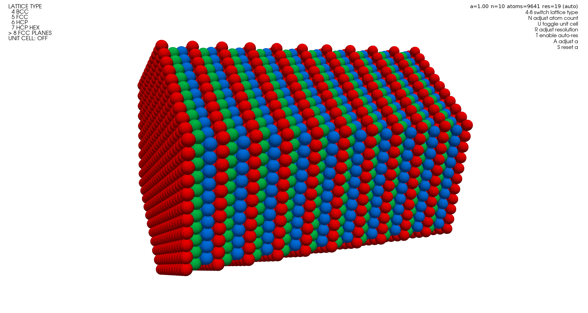

# Metal Lattice Visualisation

Interactive visualization of BCC, FCC, and HCP crystal lattices with PyVista.
The project generates crystal structures programmatically and renders them in an interactive 3D viewer.



## Features

- Generates BCC, FCC, HCP, and layered FCC(111) structures
- Interactive 3D rendering with adjustable atom count and sphere resolution
- Plane-based color mapping for improved structural readability
- Automated tests for lattice generation, plotting helpers, and resolution logic
- Windows `.exe` build pipeline via GitHub Actions

## Quick Start

```powershell
python -m pip install -e .[dev]
python main.py
```

After installation, you can also launch the app with:

```powershell
metal-lattice-vis
```

## Viewer Controls

- `4-8`: switch lattice type
- `N`: adjust atom count per direction
- `U`: toggle unit cell mode
- `R`: set manual sphere resolution
- `T`: re-enable automatic resolution
- `A`: adjust the lattice constant `a`
- `S`: reset the lattice constant

## Tests

```powershell
python -m pytest -q
```

## Project Structure

```text
src/vis/generation.py          Lattice generation logic
src/vis/plotting.py            Plotting and color helpers
src/vis/interactive_viewer.py  Interactive PyVista application
tests/                         Automated test suite
```

## Local Release Check

Use the following script to run the same release-style build that is used in GitHub Actions:

```powershell
.\scripts\release-check.ps1
```

Optional flags:

```powershell
.\scripts\release-check.ps1 -SkipTests
.\scripts\release-check.ps1 -OpenDist
```

## Windows `.exe` Releases

The `release-windows-exe.yml` workflow automatically builds a Windows executable for tags matching `v*` and publishes it as a release asset.

```powershell
git tag v0.2.3
git push origin v0.2.3
```

You can then find `Metal-Lattice-Visualisation.exe` in:
- GitHub release assets
- GitHub Actions artifacts
